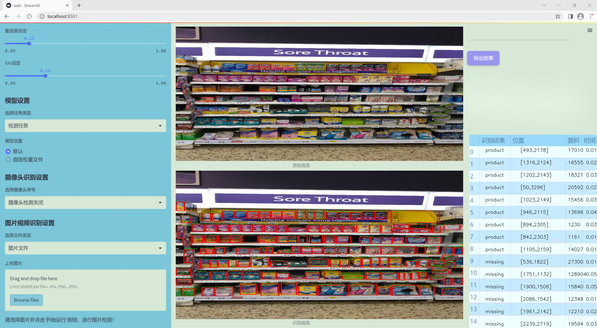
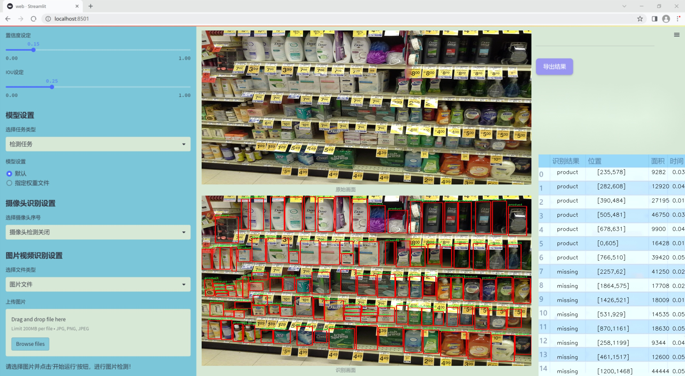
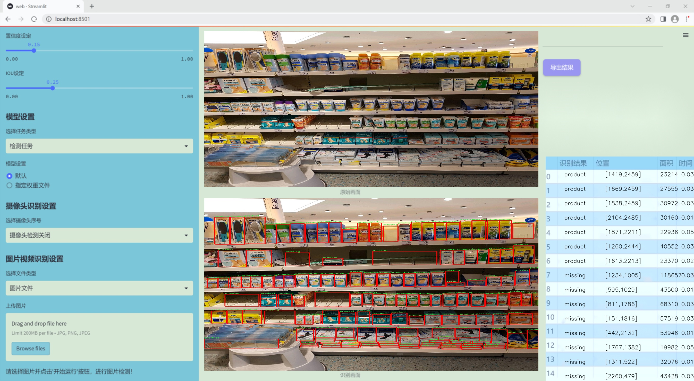
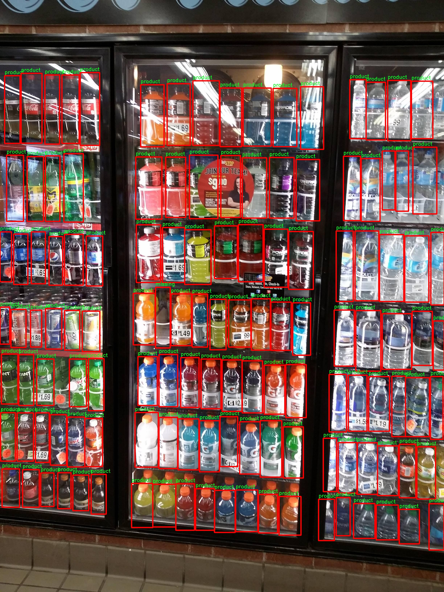

# 改进yolo11-AFPN-P345等200+全套创新点大全：超市货架空缺检测系统源码＆数据集全套

### 1.图片效果展示







##### 项目来源 **[人工智能促进会 2024.10.28](https://kdocs.cn/l/cszuIiCKVNis)**

注意：由于项目一直在更新迭代，上面“1.图片效果展示”和“2.视频效果展示”展示的系统图片或者视频可能为老版本，新版本在老版本的基础上升级如下：（实际效果以升级的新版本为准）

  （1）适配了YOLOV11的“目标检测”模型和“实例分割”模型，通过加载相应的权重（.pt）文件即可自适应加载模型。

  （2）支持“图片识别”、“视频识别”、“摄像头实时识别”三种识别模式。

  （3）支持“图片识别”、“视频识别”、“摄像头实时识别”三种识别结果保存导出，解决手动导出（容易卡顿出现爆内存）存在的问题，识别完自动保存结果并导出到tempDir中。

  （4）支持Web前端系统中的标题、背景图等自定义修改。

  另外本项目提供训练的数据集和训练教程,暂不提供权重文件（best.pt）,需要您按照教程进行训练后实现图片演示和Web前端界面演示的效果。

### 2.视频效果展示

[2.1 视频效果展示](https://www.bilibili.com/video/BV1rG15YcEcY/)

### 3.背景

研究背景与意义

随着零售行业的快速发展，超市作为重要的消费场所，其货架管理的有效性直接影响到顾客的购物体验和超市的销售业绩。货架空缺问题，尤其是缺货现象，不仅导致顾客无法找到所需商品，还可能使顾客转向竞争对手，从而造成经济损失。因此，及时、准确地检测超市货架上的空缺情况，成为提升超市运营效率和顾客满意度的重要环节。

近年来，计算机视觉技术的迅猛发展为货架空缺检测提供了新的解决方案。YOLO（You Only Look Once）系列模型因其高效的实时目标检测能力，已被广泛应用于各类视觉识别任务。特别是YOLOv11模型，凭借其在精度和速度上的优势，成为了货架空缺检测的理想选择。然而，传统YOLO模型在处理特定场景下的货架空缺检测时，仍存在一定的局限性，如对空缺区域的识别精度不足、背景干扰等问题。因此，基于改进YOLOv11的超市货架空缺检测系统的研究显得尤为重要。

本项目将利用包含1400张图像的“超市货架空缺”数据集，专注于识别货架上缺失的商品。该数据集的单一类别“缺失商品”将为模型的训练提供清晰的目标，使其能够更好地学习和识别货架空缺的特征。通过对YOLOv11模型的改进，结合深度学习技术，我们期望提升检测的准确性和实时性，从而为超市管理者提供有效的决策支持。这不仅有助于优化货架管理，提高商品周转率，还能提升顾客的购物体验，最终推动超市的整体业绩增长。因此，本研究具有重要的理论价值和实际应用意义。

### 4.数据集信息展示

##### 4.1 本项目数据集详细数据（类别数＆类别名）

nc: 3
names: ['-', 'missing', 'product']


该项目为【目标检测】数据集，请在【训练教程和Web端加载模型教程（第三步）】这一步的时候按照【目标检测】部分的教程来训练

##### 4.2 本项目数据集信息介绍

本项目数据集信息介绍

本项目所使用的数据集名为“Empty spaces in a supermarket hanger”，旨在为改进YOLOv11的超市货架空缺检测系统提供支持。该数据集专注于超市货架的空缺情况，特别是通过图像识别技术来检测货架上缺失的商品。数据集中包含三种主要类别，分别为“缺失”（missing）、“产品”（product）和“空白”（-），这三类标签能够有效地帮助模型识别和分类货架上的状态。

在数据集的构建过程中，研究团队收集了大量超市货架的图像，涵盖了不同类型的商品和货架布局。这些图像不仅展示了正常情况下货架的商品排列，还特别标注了空缺的区域，确保模型能够准确学习到何时货架上存在缺失商品的情况。通过这种方式，数据集不仅丰富了训练样本的多样性，还增强了模型对实际超市环境的适应能力。

数据集的设计考虑到了现实世界中超市货架的复杂性，包括不同的照明条件、货架高度和商品种类等因素。这些多样化的场景为YOLOv11模型的训练提供了丰富的上下文信息，使其在实际应用中能够更好地识别和处理货架空缺问题。此外，数据集的标签系统清晰明了，能够有效地指导模型学习如何区分正常商品与缺失商品，从而提高检测的准确性和效率。

总之，“Empty spaces in a supermarket hanger”数据集为本项目提供了坚实的基础，助力于开发出更为智能和高效的超市货架空缺检测系统，以应对日益增长的零售行业需求。通过充分利用这一数据集，研究团队期望能够实现更高的检测精度和更快的响应速度，为超市管理提供有力的技术支持。




### 5.全套项目环境部署视频教程（零基础手把手教学）

[5.1 所需软件PyCharm和Anaconda安装教程（第一步）](https://www.bilibili.com/video/BV1BoC1YCEKi/?spm_id_from=333.999.0.0&vd_source=bc9aec86d164b67a7004b996143742dc)


[5.2 安装Python虚拟环境创建和依赖库安装视频教程（第二步）](https://www.bilibili.com/video/BV1ZoC1YCEBw?spm_id_from=333.788.videopod.sections&vd_source=bc9aec86d164b67a7004b996143742dc)

### 6.改进YOLOv11训练教程和Web_UI前端加载模型教程（零基础手把手教学）

[6.1 改进YOLOv11训练教程和Web_UI前端加载模型教程（第三步）](https://www.bilibili.com/video/BV1BoC1YCEhR?spm_id_from=333.788.videopod.sections&vd_source=bc9aec86d164b67a7004b996143742dc)


按照上面的训练视频教程链接加载项目提供的数据集，运行train.py即可开始训练



     Epoch   gpu_mem       box       obj       cls    labels  img_size
     1/200     20.8G   0.01576   0.01955  0.007536        22      1280: 100%|██████████| 849/849 [14:42<00:00,  1.04s/it]
               Class     Images     Labels          P          R     mAP@.5 mAP@.5:.95: 100%|██████████| 213/213 [01:14<00:00,  2.87it/s]
                 all       3395      17314      0.994      0.957      0.0957      0.0843

     Epoch   gpu_mem       box       obj       cls    labels  img_size
     2/200     20.8G   0.01578   0.01923  0.007006        22      1280: 100%|██████████| 849/849 [14:44<00:00,  1.04s/it]
               Class     Images     Labels          P          R     mAP@.5 mAP@.5:.95: 100%|██████████| 213/213 [01:12<00:00,  2.95it/s]
                 all       3395      17314      0.996      0.956      0.0957      0.0845

     Epoch   gpu_mem       box       obj       cls    labels  img_size
     3/200     20.8G   0.01561    0.0191  0.006895        27      1280: 100%|██████████| 849/849 [10:56<00:00,  1.29it/s]
               Class     Images     Labels          P          R     mAP@.5 mAP@.5:.95: 100%|███████   | 187/213 [00:52<00:00,  4.04it/s]
                 all       3395      17314      0.996      0.957      0.0957      0.0845


###### [项目数据集下载链接](https://kdocs.cn/l/cszuIiCKVNis)

### 7.原始YOLOv11算法讲解


##### YOLO11介绍

Ultralytics YOLO11是一款尖端的、最先进的模型，它在之前YOLO版本成功的基础上进行了构建，并引入了新功能和改进，以进一步提升性能和灵活性。
**YOLO11设计快速、准确且易于使用，使其成为各种物体检测和跟踪、实例分割、图像分类以及姿态估计任务的绝佳选择。**


**结构图如下：**


##### **C3k2**

**C3k2，结构图如下**


**C3k2，继承自类`C2f，其中通过c3k设置False或者Ture来决定选择使用C3k还是`**Bottleneck


**实现代码** **ultralytics/nn/modules/block.py**

##### C2PSA介绍

**借鉴V10 PSA结构，实现了C2PSA和C2fPSA，最终选择了基于C2的C2PSA（可能涨点更好？）**


**实现代码** **ultralytics/nn/modules/block.py**

##### Detect介绍

**分类检测头引入了DWConv（更加轻量级，为后续二次创新提供了改进点），结构图如下（和V8的区别）：**


### 8.200+种全套改进YOLOV11创新点原理讲解

#### 8.1 200+种全套改进YOLOV11创新点原理讲解大全

由于篇幅限制，每个创新点的具体原理讲解就不全部展开，具体见下列网址中的改进模块对应项目的技术原理博客网址【Blog】（创新点均为模块化搭建，原理适配YOLOv5~YOLOv11等各种版本）

[改进模块技术原理博客【Blog】网址链接](https://gitee.com/qunmasj/good)


#### 8.2 精选部分改进YOLOV11创新点原理讲解

###### 这里节选部分改进创新点展开原理讲解(完整的改进原理见上图和[改进模块技术原理博客链接](https://gitee.com/qunmasj/good)【如果此小节的图加载失败可以通过CSDN或者Github搜索该博客的标题访问原始博客，原始博客图片显示正常】

### Gold-YOLO


#### Preliminaries
YOLO系列的中间层结构采用了传统的FPN结构，其中包含多个分支用于多尺度特征融合。然而，它只充分融合来自相邻级别的特征，对于其他层次的信息只能间接地进行“递归”获取。

传统的FPN结构在信息传输过程中存在丢失大量信息的问题。这是因为层之间的信息交互仅限于中间层选择的信息，未被选择的信息在传输过程中被丢弃。这种情况导致某个Level的信息只能充分辅助相邻层，而对其他全局层的帮助较弱。因此，整体上信息融合的有效性可能受到限制。
为了避免在传输过程中丢失信息，本文采用了一种新颖的“聚集和分发”机制（GD），放弃了原始的递归方法。该机制使用一个统一的模块来收集和融合所有Level的信息，并将其分发到不同的Level。通过这种方式，作者不仅避免了传统FPN结构固有的信息丢失问题，还增强了中间层的部分信息融合能力，而且并没有显著增加延迟。


#### 低阶聚合和分发分支 Low-stage gather-and-distribute branch
从主干网络中选择输出的B2、B3、B4、B5特征进行融合，以获取保留小目标信息的高分辨率特征。


#### 高阶聚合和分发分支 High-stage gather-and-distribute branch
高级全局特征对齐模块（High-GD）将由低级全局特征对齐模块（Low-GD）生成的特征{P3, P4, P5}进行融合。


Transformer融合模块由多个堆叠的transformer组成，transformer块的数量为L。每个transformer块包括一个多头注意力块、一个前馈网络（FFN）和残差连接。采用与LeViT相同的设置来配置多头注意力块，使用16个通道作为键K和查询Q的头维度，32个通道作为值V的头维度。为了加速推理过程，将层归一化操作替换为批归一化，并将所有的GELU激活函数替换为ReLU。为了增强变换器块的局部连接，在两个1x1卷积层之间添加了一个深度卷积层。同时，将FFN的扩展因子设置为2，以在速度和计算成本之间取得平衡。


信息注入模块(Information injection module)： 高级全局特征对齐模块（High-GD）中的信息注入模块与低级全局特征对齐模块（Low-GD）中的相同。在高级阶段，局部特征（Flocal）等于Pi，因此公式如下所示：


#### 增强的跨层信息流动 Enhanced cross-layer information flow
为了进一步提升性能，从YOLOv6 中的PAFPN模块中得到启发，引入了Inject-LAF模块。该模块是注入模块的增强版，包括了一个轻量级相邻层融合（LAF）模块，该模块被添加到注入模块的输入位置。为了在速度和准确性之间取得平衡，设计了两个LAF模型：LAF低级模型和LAF高级模型，分别用于低级注入（合并相邻两层的特征）和高级注入（合并相邻一层的特征）。它们的结构如图5(b)所示。为了确保来自不同层级的特征图与目标大小对齐，在实现中的两个LAF模型仅使用了三个操作符：双线性插值（上采样过小的特征）、平均池化（下采样过大的特征）和1x1卷积（调整与目标通道不同的特征）。模型中的LAF模块与信息注入模块的结合有效地平衡了准确性和速度之间的关系。通过使用简化的操作，能够增加不同层级之间的信息流路径数量，从而提高性能而不显著增加延迟。


### 9.系统功能展示

图9.1.系统支持检测结果表格显示

  图9.2.系统支持置信度和IOU阈值手动调节

  图9.3.系统支持自定义加载权重文件best.pt(需要你通过步骤5中训练获得)

  图9.4.系统支持摄像头实时识别

  图9.5.系统支持图片识别

  图9.6.系统支持视频识别

  图9.7.系统支持识别结果文件自动保存

  图9.8.系统支持Excel导出检测结果数据


### 10. YOLOv11核心改进源码讲解

#### 10.1 CTrans.py

以下是对代码中最核心部分的提炼和详细中文注释：

```python
import torch
import torch.nn as nn
import math
from torch.nn import Dropout, Softmax, LayerNorm

class Channel_Embeddings(nn.Module):
    """构建通道嵌入，包括补丁嵌入和位置嵌入。"""
    def __init__(self, patchsize, img_size, in_channels):
        super().__init__()
        img_size = (img_size, img_size)  # 将图像大小转换为元组
        patch_size = (patchsize, patchsize)  # 将补丁大小转换为元组
        n_patches = (img_size[0] // patch_size[0]) * (img_size[1] // patch_size[1])  # 计算补丁数量

        # 定义补丁嵌入层
        self.patch_embeddings = nn.Sequential(
            nn.MaxPool2d(kernel_size=5, stride=5),  # 最大池化层
            nn.Conv2d(in_channels=in_channels,
                      out_channels=in_channels,
                      kernel_size=patchsize // 5,
                      stride=patchsize // 5)  # 卷积层
        )

        # 定义位置嵌入参数
        self.position_embeddings = nn.Parameter(torch.zeros(1, n_patches, in_channels))
        self.dropout = Dropout(0.1)  # Dropout层，防止过拟合

    def forward(self, x):
        """前向传播，计算嵌入。"""
        if x is None:
            return None
        x = self.patch_embeddings(x)  # 计算补丁嵌入
        x = x.flatten(2)  # 展平为 (B, n_patches, hidden)
        x = x.transpose(-1, -2)  # 转置为 (B, n_patches, hidden)
        embeddings = x + self.position_embeddings  # 加上位置嵌入
        embeddings = self.dropout(embeddings)  # 应用Dropout
        return embeddings

class Attention_org(nn.Module):
    """自定义的多头注意力机制。"""
    def __init__(self, vis, channel_num):
        super(Attention_org, self).__init__()
        self.vis = vis  # 可视化标志
        self.KV_size = sum(channel_num)  # 键值对的总通道数
        self.channel_num = channel_num  # 通道数列表
        self.num_attention_heads = 4  # 注意力头的数量

        # 定义查询、键、值的线性变换
        self.query = nn.ModuleList([nn.Linear(c, c, bias=False) for c in channel_num])
        self.key = nn.Linear(self.KV_size, self.KV_size, bias=False)
        self.value = nn.Linear(self.KV_size, self.KV_size, bias=False)

        self.psi = nn.InstanceNorm2d(self.num_attention_heads)  # 实例归一化
        self.softmax = Softmax(dim=3)  # Softmax层
        self.attn_dropout = Dropout(0.1)  # 注意力的Dropout
        self.proj_dropout = Dropout(0.1)  # 投影的Dropout

    def forward(self, *embeddings):
        """前向传播，计算注意力输出。"""
        multi_head_Q = [query(emb) for query, emb in zip(self.query, embeddings) if emb is not None]
        multi_head_K = self.key(torch.cat(embeddings, dim=2))  # 合并所有嵌入并计算键
        multi_head_V = self.value(torch.cat(embeddings, dim=2))  # 合并所有嵌入并计算值

        # 计算注意力分数
        attention_scores = [torch.matmul(Q, multi_head_K) / math.sqrt(self.KV_size) for Q in multi_head_Q]
        attention_probs = [self.softmax(self.psi(score)) for score in attention_scores]  # 计算注意力概率

        # 应用Dropout
        attention_probs = [self.attn_dropout(prob) for prob in attention_probs]
        context_layers = [torch.matmul(prob, multi_head_V) for prob in attention_probs]  # 计算上下文层

        # 线性变换输出
        outputs = [query(context) for query, context in zip(self.query, context_layers)]
        return outputs

class ChannelTransformer(nn.Module):
    """通道变换器模型。"""
    def __init__(self, channel_num=[64, 128, 256, 512], img_size=640, vis=False, patchSize=[40, 20, 10, 5]):
        super().__init__()
        self.embeddings = nn.ModuleList([Channel_Embeddings(patch, img_size // (2 ** i), channels) 
                                          for i, (patch, channels) in enumerate(zip(patchSize, channel_num))])
        self.encoder = Encoder(vis, channel_num)  # 编码器
        self.reconstruct = nn.ModuleList([Reconstruct(channels, channels, kernel_size=1, scale_factor=(patch, patch)) 
                                           for patch, channels in zip(patchSize, channel_num)])

    def forward(self, en):
        """前向传播，计算最终输出。"""
        embeddings = [embed(en[i]) for i, embed in enumerate(self.embeddings) if en[i] is not None]
        encoded = self.encoder(*embeddings)  # 编码嵌入
        reconstructed = [recon(enc) + en[i] for i, (recon, enc) in enumerate(zip(self.reconstruct, encoded)) if en[i] is not None]
        return reconstructed
```

### 代码核心部分分析：
1. **Channel_Embeddings**: 负责将输入图像转换为补丁嵌入和位置嵌入，使用卷积和最大池化层来提取特征。
2. **Attention_org**: 实现了多头注意力机制，计算输入嵌入之间的注意力分数，并生成上下文向量。
3. **ChannelTransformer**: 整合了通道嵌入、编码器和重建模块，构成了整个变换器模型的核心结构。

### 注释说明：
- 每个类和方法都添加了详细的中文注释，解释其功能和实现细节，帮助理解代码的结构和逻辑。

这个文件定义了一个名为 `CTrans.py` 的深度学习模型，主要用于图像处理任务，尤其是基于通道的变换器（Channel Transformer）。模型的设计灵感来自于视觉变换器（Vision Transformer），并通过多种模块来实现图像的特征提取和重建。

首先，文件中引入了一些必要的库，包括 `torch` 和 `torch.nn`，这些库提供了构建神经网络所需的基本组件。接下来，定义了几个类，每个类负责模型的不同部分。

`Channel_Embeddings` 类用于构建图像的嵌入表示。它通过卷积和池化操作将输入图像划分为多个小块（patch），并为每个小块生成位置嵌入。这个类的 `forward` 方法负责将输入图像转换为嵌入表示，并应用位置嵌入和 dropout 操作。

`Reconstruct` 类用于将嵌入表示重建为图像。它通过卷积和上采样操作将嵌入转换回图像的空间维度，并应用批归一化和激活函数。

`Attention_org` 类实现了多头注意力机制。它通过对输入的嵌入进行线性变换，计算注意力分数，并生成上下文层。这个类的设计允许对多个通道的嵌入进行并行处理，并在计算注意力时考虑所有通道的信息。

`Mlp` 类实现了一个简单的多层感知机（MLP），用于对嵌入进行非线性变换。它包含两个全连接层和一个激活函数（GELU），并在前向传播中应用 dropout。

`Block_ViT` 类结合了注意力机制和多层感知机，形成一个完整的变换器块。它首先对输入的嵌入进行层归一化，然后通过注意力机制进行处理，最后通过 MLP 进行非线性变换。这个类的设计使得它能够处理多个通道的嵌入，并在每个通道上应用相同的操作。

`Encoder` 类是一个由多个 `Block_ViT` 组成的编码器。它负责对输入的嵌入进行多次变换，并输出经过处理的嵌入。每个变换块的输出都经过层归一化，以确保模型的稳定性。

`ChannelTransformer` 类是整个模型的核心。它初始化了多个嵌入层、编码器和重建层。模型的前向传播过程包括将输入图像转换为嵌入，经过编码器处理后再重建为图像。这个类的设计使得模型能够处理不同大小的图像和通道。

最后，`GetIndexOutput` 类用于从模型的输出中提取特定的索引。这在需要从多个输出中选择特定结果时非常有用。

整体来看，这个文件实现了一个复杂的图像处理模型，利用了深度学习中的多种技术，如卷积、注意力机制和多层感知机，旨在有效地提取和重建图像特征。

#### 10.2 val.py

以下是代码中最核心的部分，并附上详细的中文注释：

```python
class DetectionValidator(BaseValidator):
    """
    扩展自 BaseValidator 类的检测模型验证器。
    """

    def __init__(self, dataloader=None, save_dir=None, pbar=None, args=None, _callbacks=None):
        """初始化检测模型，设置必要的变量和参数。"""
        super().__init__(dataloader, save_dir, pbar, args, _callbacks)
        self.nt_per_class = None  # 每个类别的目标数量
        self.is_coco = False  # 是否为 COCO 数据集
        self.class_map = None  # 类别映射
        self.args.task = "detect"  # 任务类型设置为检测
        self.metrics = DetMetrics(save_dir=self.save_dir, on_plot=self.on_plot)  # 初始化检测指标
        self.iouv = torch.linspace(0.5, 0.95, 10)  # mAP@0.5:0.95 的 IoU 向量
        self.niou = self.iouv.numel()  # IoU 的数量
        self.lb = []  # 用于自动标注

    def preprocess(self, batch):
        """对图像批次进行预处理，以便用于 YOLO 训练。"""
        batch["img"] = batch["img"].to(self.device, non_blocking=True)  # 将图像移动到设备上
        batch["img"] = (batch["img"].half() if self.args.half else batch["img"].float()) / 255  # 归一化图像
        for k in ["batch_idx", "cls", "bboxes"]:
            batch[k] = batch[k].to(self.device)  # 将其他数据移动到设备上

        # 如果需要保存混合数据
        if self.args.save_hybrid:
            height, width = batch["img"].shape[2:]  # 获取图像的高度和宽度
            nb = len(batch["img"])  # 批次中图像的数量
            bboxes = batch["bboxes"] * torch.tensor((width, height, width, height), device=self.device)  # 计算边界框
            self.lb = (
                [
                    torch.cat([batch["cls"][batch["batch_idx"] == i], bboxes[batch["batch_idx"] == i]], dim=-1)
                    for i in range(nb)
                ]
                if self.args.save_hybrid
                else []
            )  # 为自动标注准备数据

        return batch  # 返回处理后的批次

    def postprocess(self, preds):
        """对预测输出应用非极大值抑制。"""
        return ops.non_max_suppression(
            preds,
            self.args.conf,  # 置信度阈值
            self.args.iou,  # IoU 阈值
            labels=self.lb,  # 标签
            multi_label=True,  # 多标签
            agnostic=self.args.single_cls,  # 是否单类
            max_det=self.args.max_det,  # 最大检测数量
        )

    def update_metrics(self, preds, batch):
        """更新检测指标。"""
        for si, pred in enumerate(preds):  # 遍历每个预测
            self.seen += 1  # 更新已处理的样本数量
            npr = len(pred)  # 当前预测的数量
            stat = dict(
                conf=torch.zeros(0, device=self.device),  # 置信度
                pred_cls=torch.zeros(0, device=self.device),  # 预测类别
                tp=torch.zeros(npr, self.niou, dtype=torch.bool, device=self.device),  # 真阳性
            )
            pbatch = self._prepare_batch(si, batch)  # 准备当前批次的数据
            cls, bbox = pbatch.pop("cls"), pbatch.pop("bbox")  # 获取类别和边界框
            nl = len(cls)  # 目标数量
            stat["target_cls"] = cls  # 记录目标类别

            if npr == 0:  # 如果没有预测
                if nl:  # 如果有目标
                    for k in self.stats.keys():
                        self.stats[k].append(stat[k])  # 更新统计数据
                continue  # 跳过当前循环

            # 处理预测
            if self.args.single_cls:
                pred[:, 5] = 0  # 如果是单类，将类别设置为 0
            predn = self._prepare_pred(pred, pbatch)  # 准备预测数据
            stat["conf"] = predn[:, 4]  # 记录置信度
            stat["pred_cls"] = predn[:, 5]  # 记录预测类别

            # 评估
            if nl:  # 如果有目标
                stat["tp"] = self._process_batch(predn, bbox, cls)  # 处理当前批次
            for k in self.stats.keys():
                self.stats[k].append(stat[k])  # 更新统计数据

            # 保存预测结果
            if self.args.save_json:
                self.pred_to_json(predn, batch["im_file"][si])  # 保存为 JSON 格式
            if self.args.save_txt:
                file = self.save_dir / "labels" / f'{Path(batch["im_file"][si]).stem}.txt'  # 保存为 TXT 格式
                self.save_one_txt(predn, self.args.save_conf, pbatch["ori_shape"], file)

    def get_stats(self):
        """返回指标统计和结果字典。"""
        stats = {k: torch.cat(v, 0).cpu().numpy() for k, v in self.stats.items()}  # 转换为 numpy 数组
        if len(stats) and stats["tp"].any():  # 如果有真阳性
            self.metrics.process(**stats)  # 处理指标
        self.nt_per_class = np.bincount(
            stats["target_cls"].astype(int), minlength=self.nc
        )  # 计算每个类别的目标数量
        return self.metrics.results_dict  # 返回结果字典
```

### 代码核心部分说明：
1. **DetectionValidator 类**：用于扩展基本验证器，专门处理目标检测任务。
2. **初始化方法**：设置必要的参数和指标，准备进行验证。
3. **预处理方法**：对输入的图像批次进行归一化和设备转移，为后续处理做准备。
4. **后处理方法**：应用非极大值抑制来过滤掉冗余的检测结果。
5. **更新指标方法**：在每个批次中更新检测指标，包括真阳性、置信度等。
6. **获取统计方法**：计算并返回检测结果的统计信息。

以上是对代码核心部分的提炼和详细注释，帮助理解其主要功能和逻辑。

这个程序文件 `val.py` 是一个用于YOLO（You Only Look Once）目标检测模型验证的实现，继承自 `BaseValidator` 类。程序的主要功能是对目标检测模型进行验证，计算各种性能指标，并可视化结果。

首先，程序导入了一些必要的库，包括操作系统、路径处理、NumPy、PyTorch，以及Ultralytics库中的一些模块和工具。这些模块提供了数据加载、模型验证、度量计算和图像绘制等功能。

在 `DetectionValidator` 类的构造函数中，初始化了一些必要的变量和设置，包括验证数据加载器、保存目录、进度条、参数和回调函数。该类的主要任务是处理目标检测的验证过程。构造函数中还定义了一些用于计算指标的变量，如 `DetMetrics` 用于存储检测指标，`iou` 用于计算mAP（平均精度）时的IoU（交并比）阈值。

`preprocess` 方法负责对输入的图像批次进行预处理，包括将图像数据转换为适合模型输入的格式，并根据需要进行归一化。该方法还处理了用于自动标注的边界框。

`init_metrics` 方法用于初始化评估指标，包括检查数据集是否为COCO格式，并根据模型的类别名称设置相应的指标。

`get_desc` 方法返回一个格式化的字符串，用于总结YOLO模型的类别指标。

`postprocess` 方法应用非极大值抑制（NMS）来处理模型的预测输出，以去除冗余的检测框。

`_prepare_batch` 和 `_prepare_pred` 方法分别用于准备验证批次的图像和注释数据，以及准备模型的预测结果，以便进行后续的评估。

`update_metrics` 方法用于更新指标统计信息，处理每个批次的预测结果，并与真实标签进行比较，以计算TP（真正例）、FP（假正例）等统计信息。

`finalize_metrics` 方法在验证结束时设置最终的指标值，包括速度和混淆矩阵。

`get_stats` 方法返回指标统计信息和结果字典，便于后续分析。

`print_results` 方法用于打印训练或验证集的每个类别的指标结果，并可视化混淆矩阵。

`_process_batch` 方法用于返回正确的预测矩阵，通过计算IoU来判断预测框与真实框的匹配情况。

`build_dataset` 和 `get_dataloader` 方法用于构建YOLO数据集和返回数据加载器，方便在验证过程中加载数据。

`plot_val_samples` 和 `plot_predictions` 方法用于绘制验证图像样本和预测结果，并将结果保存为图像文件。

`save_one_txt` 方法将YOLO检测结果保存为特定格式的文本文件，而 `pred_to_json` 方法则将预测结果序列化为COCO格式的JSON文件。

最后，`eval_json` 方法用于评估YOLO输出的JSON格式，并返回性能统计信息，支持与COCO评估工具的集成。

整体来看，这个程序文件提供了一个完整的框架，用于验证YOLO目标检测模型的性能，计算指标，并生成可视化结果，便于用户分析模型的效果。

#### 10.3 fadc.py

以下是保留的核心代码部分，并附上详细的中文注释：

```python
import torch
import torch.nn as nn
import torch.nn.functional as F

class OmniAttention(nn.Module):
    def __init__(self, in_planes, out_planes, kernel_size, groups=1, reduction=0.0625, kernel_num=4, min_channel=16):
        super(OmniAttention, self).__init__()
        # 计算注意力通道数
        attention_channel = max(int(in_planes * reduction), min_channel)
        self.kernel_size = kernel_size
        self.kernel_num = kernel_num
        self.temperature = 1.0  # 温度参数，用于调整注意力的敏感度

        # 定义各个层
        self.avgpool = nn.AdaptiveAvgPool2d(1)  # 自适应平均池化
        self.fc = nn.Conv2d(in_planes, attention_channel, 1, bias=False)  # 全连接层
        self.bn = nn.BatchNorm2d(attention_channel)  # 批归一化
        self.relu = nn.ReLU(inplace=True)  # ReLU激活函数

        # 通道注意力
        self.channel_fc = nn.Conv2d(attention_channel, in_planes, 1, bias=True)
        self.func_channel = self.get_channel_attention

        # 过滤器注意力
        if in_planes == groups and in_planes == out_planes:  # 深度可分离卷积
            self.func_filter = self.skip
        else:
            self.filter_fc = nn.Conv2d(attention_channel, out_planes, 1, bias=True)
            self.func_filter = self.get_filter_attention

        # 空间注意力
        if kernel_size == 1:  # 点卷积
            self.func_spatial = self.skip
        else:
            self.spatial_fc = nn.Conv2d(attention_channel, kernel_size * kernel_size, 1, bias=True)
            self.func_spatial = self.get_spatial_attention

        # 核心注意力
        if kernel_num == 1:
            self.func_kernel = self.skip
        else:
            self.kernel_fc = nn.Conv2d(attention_channel, kernel_num, 1, bias=True)
            self.func_kernel = self.get_kernel_attention

        self._initialize_weights()  # 初始化权重

    def _initialize_weights(self):
        # 权重初始化
        for m in self.modules():
            if isinstance(m, nn.Conv2d):
                nn.init.kaiming_normal_(m.weight, mode='fan_out', nonlinearity='relu')
                if m.bias is not None:
                    nn.init.constant_(m.bias, 0)
            if isinstance(m, nn.BatchNorm2d):
                nn.init.constant_(m.weight, 1)
                nn.init.constant_(m.bias, 0)

    @staticmethod
    def skip(_):
        return 1.0  # 跳过操作，返回1.0

    def get_channel_attention(self, x):
        # 计算通道注意力
        channel_attention = torch.sigmoid(self.channel_fc(x).view(x.size(0), -1, 1, 1) / self.temperature)
        return channel_attention

    def get_filter_attention(self, x):
        # 计算过滤器注意力
        filter_attention = torch.sigmoid(self.filter_fc(x).view(x.size(0), -1, 1, 1) / self.temperature)
        return filter_attention

    def get_spatial_attention(self, x):
        # 计算空间注意力
        spatial_attention = self.spatial_fc(x).view(x.size(0), 1, 1, 1, self.kernel_size, self.kernel_size)
        spatial_attention = torch.sigmoid(spatial_attention / self.temperature)
        return spatial_attention

    def get_kernel_attention(self, x):
        # 计算核心注意力
        kernel_attention = self.kernel_fc(x).view(x.size(0), -1, 1, 1, 1, 1)
        kernel_attention = F.softmax(kernel_attention / self.temperature, dim=1)
        return kernel_attention

    def forward(self, x):
        # 前向传播
        x = self.avgpool(x)  # 自适应平均池化
        x = self.fc(x)  # 全连接层
        x = self.bn(x)  # 批归一化
        x = self.relu(x)  # ReLU激活
        return self.func_channel(x), self.func_filter(x), self.func_spatial(x), self.func_kernel(x)  # 返回各个注意力

class AdaptiveDilatedConv(nn.Module):
    """自适应膨胀卷积类，封装了可调变形卷积"""
    def __init__(self, in_channels, out_channels, kernel_size, stride=1, padding=0, dilation=1, groups=1, bias=True):
        super(AdaptiveDilatedConv, self).__init__()
        self.conv = nn.Conv2d(in_channels, out_channels, kernel_size, stride=stride, padding=padding, dilation=dilation, groups=groups, bias=bias)

    def forward(self, x):
        # 前向传播
        return self.conv(x)  # 直接返回卷积结果
```

### 代码说明：
1. **OmniAttention类**：实现了多种注意力机制，包括通道注意力、过滤器注意力、空间注意力和核心注意力。通过不同的全连接层和卷积层来计算注意力权重，并在前向传播中应用这些权重。

2. **AdaptiveDilatedConv类**：实现了自适应膨胀卷积，封装了标准的卷积操作，允许在卷积中使用膨胀率以捕捉更大的上下文信息。

这些类的设计使得网络能够更灵活地处理输入数据，增强特征提取能力。

这个程序文件 `fadc.py` 是一个用于深度学习的 PyTorch 模块，主要实现了一些复杂的卷积操作和注意力机制，特别是针对图像处理的任务。以下是对代码的详细讲解。

首先，文件中导入了必要的库，包括 PyTorch 和一些用于卷积操作的模块。代码中还尝试从 `mmcv` 库中导入一个名为 `ModulatedDeformConv2d` 的类，如果导入失败，则将其替换为普通的 `nn.Module`。

接下来，定义了一个名为 `OmniAttention` 的类，它是一个注意力机制模块。这个模块的初始化方法接受多个参数，包括输入和输出通道数、卷积核大小、组数、通道缩减比例等。该模块的主要功能是通过自适应的方式计算通道注意力、过滤器注意力、空间注意力和卷积核注意力。它使用了多个卷积层和激活函数来实现这些功能，并在前向传播中计算这些注意力权重。

接着，定义了一个 `generate_laplacian_pyramid` 函数，用于生成拉普拉斯金字塔。这个函数接受一个输入张量和金字塔的层数，通过逐层下采样和计算拉普拉斯差分来构建金字塔。它使用了双线性插值方法来进行上采样和下采样。

然后，定义了一个 `FrequencySelection` 类，它用于选择特定频率的特征。该类允许通过不同的池化方式（如平均池化、拉普拉斯池化等）来处理输入特征，并使用卷积层来生成频率权重。它还支持全局选择和不同的激活函数。

接下来，定义了 `AdaptiveDilatedConv` 类，这是一个自适应扩张卷积的实现。它继承自 `ModulatedDeformConv2d`，并在初始化时设置了卷积的偏移量、填充模式和其他参数。这个类的前向传播方法实现了自适应卷积操作，结合了之前定义的注意力机制。

最后，定义了 `AdaptiveDilatedDWConv` 类，这是一个针对深度可分离卷积的自适应扩张卷积实现。与 `AdaptiveDilatedConv` 类似，它也使用了注意力机制和频率选择，但在处理输入时考虑了普通卷积的维度。

整体来看，这个文件实现了一个复杂的卷积神经网络模块，结合了多种注意力机制和频率选择技术，适用于图像处理和计算机视觉任务。通过自适应的方式，该模块能够更好地捕捉输入数据中的重要特征，从而提高模型的性能。

#### 10.4 rep_block.py

以下是保留的核心代码部分，并附上详细的中文注释：

```python
import torch
import torch.nn as nn
import torch.nn.functional as F

# 定义一个用于卷积和批归一化的组合函数
def conv_bn(in_channels, out_channels, kernel_size, stride=1, padding=0, dilation=1, groups=1):
    # 创建卷积层
    conv_layer = nn.Conv2d(in_channels=in_channels, out_channels=out_channels, kernel_size=kernel_size,
                           stride=stride, padding=padding, dilation=dilation, groups=groups,
                           bias=False)  # 不使用偏置，因为后面会加上BatchNorm
    # 创建批归一化层
    bn_layer = nn.BatchNorm2d(num_features=out_channels, affine=True)
    # 将卷积层和批归一化层组合成一个顺序容器
    return nn.Sequential(conv_layer, bn_layer)

# 定义一个多分支块类
class DiverseBranchBlock(nn.Module):
    def __init__(self, in_channels, out_channels, kernel_size, stride=1, padding=None, dilation=1, groups=1):
        super(DiverseBranchBlock, self).__init__()
        
        # 如果没有指定padding，则根据kernel_size和dilation自动计算
        if padding is None:
            padding = kernel_size // 2
        
        # 定义原始卷积和批归一化
        self.dbb_origin = conv_bn(in_channels=in_channels, out_channels=out_channels, kernel_size=kernel_size,
                                  stride=stride, padding=padding, dilation=dilation, groups=groups)

        # 定义一个平均池化分支
        self.dbb_avg = nn.Sequential(
            nn.Conv2d(in_channels=in_channels, out_channels=out_channels, kernel_size=1, stride=1, padding=0, groups=groups, bias=False),
            nn.BatchNorm2d(out_channels),
            nn.AvgPool2d(kernel_size=kernel_size, stride=stride, padding=0)
        )

        # 定义一个1x1卷积分支
        self.dbb_1x1_kxk = nn.Sequential(
            nn.Conv2d(in_channels=in_channels, out_channels=out_channels, kernel_size=1, stride=stride, padding=0, groups=groups, bias=False),
            nn.BatchNorm2d(out_channels),
            nn.Conv2d(in_channels=out_channels, out_channels=out_channels, kernel_size=kernel_size, stride=stride, padding=0, groups=groups, bias=False),
            nn.BatchNorm2d(out_channels)
        )

    def forward(self, inputs):
        # 前向传播
        out = self.dbb_origin(inputs)  # 通过原始卷积分支
        out += self.dbb_avg(inputs)     # 加上平均池化分支的输出
        out += self.dbb_1x1_kxk(inputs) # 加上1x1卷积分支的输出
        return out  # 返回最终的输出

# 测试代码
if __name__ == "__main__":
    # 创建一个DiverseBranchBlock实例
    dbb = DiverseBranchBlock(in_channels=3, out_channels=16, kernel_size=3)
    # 创建一个随机输入张量
    input_tensor = torch.randn(1, 3, 32, 32)  # Batch size=1, Channels=3, Height=32, Width=32
    # 进行前向传播
    output_tensor = dbb(input_tensor)
    print(output_tensor.shape)  # 输出形状
```

### 代码说明：
1. **conv_bn**: 该函数用于创建一个包含卷积层和批归一化层的顺序模块。卷积层的偏置设置为`False`，因为后续会通过批归一化层来处理偏置。

2. **DiverseBranchBlock**: 这是一个多分支块的定义，包含三个主要分支：
   - **dbb_origin**: 原始的卷积和批归一化分支。
   - **dbb_avg**: 通过1x1卷积和平均池化实现的分支。
   - **dbb_1x1_kxk**: 通过1x1卷积和后续的卷积实现的分支。

3. **forward**: 在前向传播中，输入数据依次通过三个分支，最后将它们的输出相加并返回。

4. **测试代码**: 在`__main__`部分，创建了一个`DiverseBranchBlock`实例，并通过随机生成的输入张量测试其前向传播功能。

这个程序文件 `rep_block.py` 是一个实现多种卷积块的 PyTorch 模块，主要用于深度学习中的卷积神经网络（CNN）。该文件定义了多个类和函数，用于构建不同类型的卷积块，特别是多分支的卷积结构，以提高网络的表现力和灵活性。

首先，文件中导入了必要的库，包括 `torch` 和 `torch.nn`，这些是构建神经网络的基础库。此外，还导入了自定义的卷积模块 `Conv` 和 `autopad` 函数，这些可能用于处理卷积层的特定需求。

接下来，文件定义了一些转换函数，例如 `transI_fusebn`、`transII_addbranch` 等，这些函数用于处理卷积核和偏置的融合、分支的合并等操作。这些函数在网络的前向传播和模型转换（例如从训练模式到推理模式）中起到关键作用。

文件中定义了多个类，主要包括 `DiverseBranchBlock`、`WideDiverseBranchBlock` 和 `DeepDiverseBranchBlock`。这些类的构造函数接受多个参数，如输入通道数、输出通道数、卷积核大小、步幅、填充等，允许用户根据需求灵活配置卷积块的结构。

`DiverseBranchBlock` 类实现了一个多分支的卷积块，包含多个不同的卷积路径（如标准卷积、1x1卷积、平均池化等），并在前向传播中将这些路径的输出相加。这个设计使得网络能够从不同的特征提取路径中学习，从而提高性能。

`WideDiverseBranchBlock` 类在 `DiverseBranchBlock` 的基础上增加了水平和垂直卷积的处理，进一步增强了特征提取的能力。它通过定义额外的卷积层和批归一化层来实现这一点。

`DeepDiverseBranchBlock` 类则在 `DiverseBranchBlock` 的基础上，增加了更深层次的结构，允许更复杂的特征学习。它的设计允许在训练和推理阶段之间进行切换，以优化性能。

每个类中都实现了 `forward` 方法，用于定义前向传播的计算过程。在前向传播中，输入数据通过各个卷积层进行处理，最终将所有分支的输出相加，经过非线性激活函数后返回。

此外，文件中还定义了一些辅助方法，如 `get_equivalent_kernel_bias` 和 `switch_to_deploy`，用于获取等效的卷积核和偏置，以及在模型部署时的转换。这些方法确保在不同模式下（训练和推理）模型的行为一致。

总的来说，这个文件实现了一个灵活且强大的卷积块结构，适用于各种深度学习任务，特别是在需要高效特征提取的计算机视觉应用中。通过不同的分支和卷积策略，这些类能够有效地提高模型的表达能力和性能。

注意：由于此博客编辑较早，上面“10.YOLOv11核心改进源码讲解”中部分代码可能会优化升级，仅供参考学习，以“11.完整训练+Web前端界面+200+种全套创新点源码、数据集获取”的内容为准。

### 11.完整训练+Web前端界面+200+种全套创新点源码、数据集获取


# [下载链接：https://mbd.pub/o/bread/Zp6XlJ9x](https://mbd.pub/o/bread/Zp6XlJ9x)